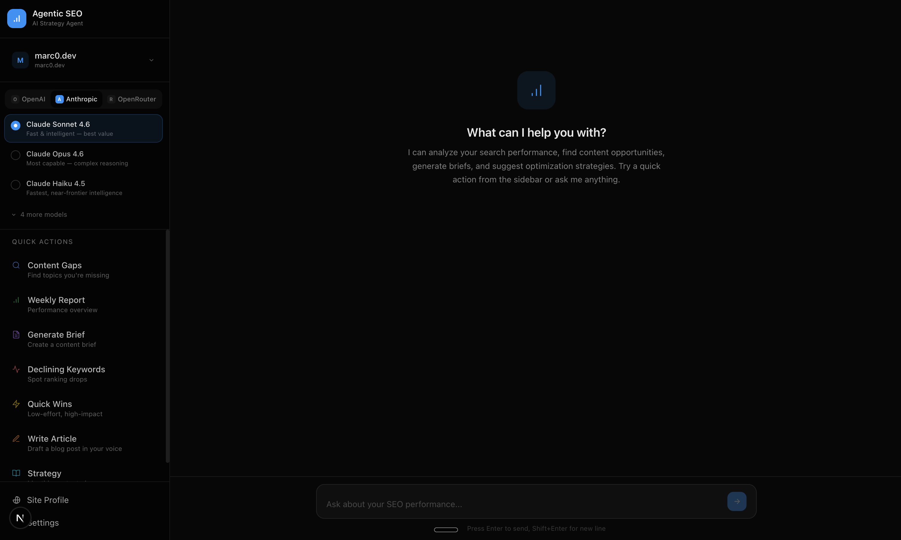
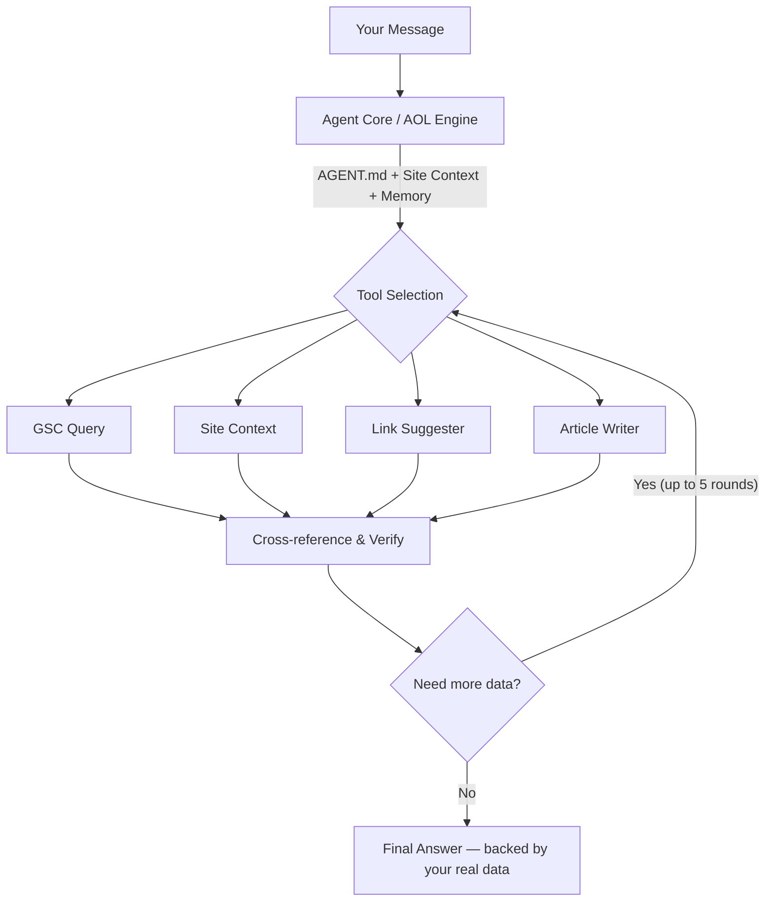
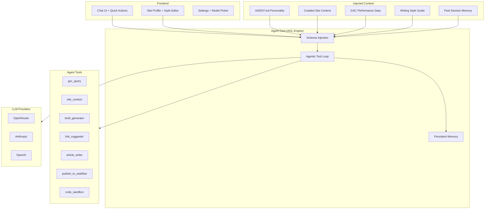

<p align="center">
  <h1 align="center">Agentic SEO</h1>
  <p align="center">
    The open-source AI agent that does your SEO — not just talks about it.
    <br />
    Connects to Google Search Console. Crawls your site. Investigates your data. Writes content in your voice.
  </p>
</p>

<p align="center">
  <a href="#quick-start">Quick Start</a> &bull;
  <a href="#why-agentic">Why Agentic?</a> &bull;
  <a href="#features">Features</a> &bull;
  <a href="#supported-models">Models</a> &bull;
  <a href="#how-it-works">How It Works</a> &bull;
  <a href="#license">License</a>
</p>

---

<p align="center">
  
</p>

## Why Agentic?

Most "AI SEO tools" are glorified prompt wrappers. You paste a keyword, they hit an API once, and you get generic advice that could apply to any site on the internet. They don't know your content. They don't see your data. They don't investigate.

**Agentic SEO is fundamentally different.** It's not a chatbot with an SEO prompt — it's an autonomous agent with tools.

Here's what that means in practice:

When you ask "Why is my traffic dropping?", a normal AI tool gives you a generic checklist. Agentic SEO does this:

```
Agent:
  → Calls gsc_query(type: "declining") — finds 15 keywords losing position
  → Calls gsc_query(type: "trends", keyword: "react server components") — pulls 90-day trend
  → Calls site_context(topic: "react server components") — checks your actual page content
  → Calls link_suggester(keyword: "react server components") — finds internal linking gaps
  → Returns: specific diagnosis + 4 action items backed by your real numbers
```

Five tool calls. Three data sources cross-referenced. One answer that's specific to YOUR site — because the agent actually looked at your data before speaking.

This is what **agentic** means: the AI doesn't just respond, it acts. It has a loop — plan, execute, verify — and it keeps going until it has a real answer. Up to 5 rounds of tool calls per message. No hand-holding required.

**The pattern behind it — the Agentic Orchestration Layer (AOL) — is what makes this work.** The LLM receives your full site context (crawled pages, GSC performance data, sitemap, memory from past sessions) injected into every request. Then it decides which tools to call, in what order, and iterates until the answer is solid.

Other tools show you dashboards. This one does the work.

## Origin Story

This started as a manual workflow. I connected Claude Code to my Supabase CMS and Google Search Console, wrote knowledge files for context, and let the agent manage my blog's SEO — writing, optimizing, monitoring, publishing.

**The result: 68,000 impressions and 1,300 clicks in 9 days.** My blog went from ~5 impressions/week to 200 clicks/day.

This project packages that entire workflow into something anyone can run. Self-hosted, open source, bring your own API key.

## Features

**Google Search Console Integration** — OAuth connect, auto-sync 90 days of query + page data with date-level trends. Declining keywords, growing opportunities, and quick wins — found automatically. Tokens auto-refresh so you never have to re-authenticate.

**Site Crawler** — Sitemap-based crawling with Mozilla Readability for clean content extraction. Maps internal links, extracts metadata, builds a full content inventory the agent can reference.

**Writing Style Generation** — One click generates a complete writing style guide from your site's brand voice. The system reads your homepage and top pages, then produces 6 style files: Tone, Structure, Sentence Style, Examples, Anti-Words, and Context. No existing blog posts needed — it generates the style from your brand identity. Every file is viewable and editable directly in the UI.

**Article Writer** — Full blog post generation that actually sounds like your brand. The agent loads your style guide, weaves in related keywords from GSC data, and includes internal links to relevant pages on your site. Tell it a topic and target keyword, get a publish-ready draft. No AI slop — the Anti-Words system bans 50+ overused AI phrases.

**Multi-Project Support** — Run SEO for multiple sites from one install. Each project gets its own isolated data — crawled pages, GSC data, writing style, chat history, and memory. Switch between projects without losing anything.

**20+ Models via 3 Providers** — Use whatever model fits your budget. You need at least one API key:

| Provider | Models | Best For |
|----------|--------|----------|
| **[OpenRouter](https://openrouter.ai/keys)** (recommended) | MiniMax M2.5, DeepSeek V3.2, Kimi K2.5, Qwen 3.5+, Gemini 2.5, Llama 4 | Best value — MiniMax M2.5 has strong agentic capabilities at a fraction of the cost |
| **[Anthropic](https://console.anthropic.com/)** | Claude Opus 4.6, Sonnet 4.6, Haiku 4.5 | Best agent behavior, most thorough analysis |
| **[OpenAI](https://platform.openai.com/api-keys)** | GPT-5.2, GPT-4.1, o3-mini | Great all-rounder |

> **Cost-conscious?** Go with OpenRouter + MiniMax M2.5. Great agentic tool-use capabilities, and you'll spend pennies per session.

**Content Briefs** — Structured briefs with target keywords, suggested outline, word count targets, and internal linking opportunities from your sitemap.

**Internal Link Suggestions** — The agent knows every URL in your sitemap and every page it's crawled. It suggests contextual links based on actual content overlap, not keyword matching.

**Quick Actions** — One-click from the chat: Content Gaps, Weekly Report, Generate Brief, Declining Keywords, Quick Wins, Write Article, and Strategy.

**Editable Agent Personality** — `data/AGENT.md` controls how the agent thinks and writes. Change its tone, focus area, language, or output format. Fork someone else's `AGENT.md` to try a different strategy. No code changes needed.

**Persistent Memory** — After each conversation, the agent extracts key findings into memory. Next session, it remembers what it learned: keyword movements, decisions you made, content gaps it identified. SEO is longitudinal — your agent should be too.

**Webflow CMS Publishing** — Connect your Webflow CMS from the Site Profile page. Enter your API token, pick a site and collection, and the agent gets a `publish_to_webflow` tool. Write an article, then publish it directly as a draft — nothing goes live without your review in Webflow. The collection schema is injected into the agent context so it knows exactly which fields to populate.

**Editable Site Profile** — View and edit all crawled content, metadata, headings, and internal links per page. Expand any page to see its full structure, edit inline, or remove it. See your sitemap with visual crawl status indicators. Re-crawl or re-sync GSC anytime.

## Quick Start

### Prerequisites

- Node.js 18+
- A Google Cloud project with [Search Console API](https://console.cloud.google.com/apis/library/searchconsole.googleapis.com) enabled
- At least one LLM API key — [OpenRouter](https://openrouter.ai/keys) (recommended), [Anthropic](https://console.anthropic.com/), or [OpenAI](https://platform.openai.com/api-keys)

### Setup

```bash
git clone https://github.com/Dominien/agentic-seo-agent.git
cd agentic-seo-agent
npm install

cp .env.example .env.local
# Add your Google OAuth credentials + at least one LLM API key

npm run dev
```

Open [http://localhost:3000](http://localhost:3000). The app walks you through onboarding:

1. **Connect** — Authorize Google Search Console
2. **Select Property** — Pick your site
3. **Crawl & Sync** — Auto-crawl your site + pull 90 days of GSC data
4. **Chat** — Start asking questions

No database to set up. No Docker. No config files to wrestle with.

### Environment Variables

Your `.env.local` needs Google OAuth credentials and at least one LLM API key:

```bash
# Google OAuth (required for GSC)
GOOGLE_CLIENT_ID=your-client-id
GOOGLE_CLIENT_SECRET=your-client-secret
GOOGLE_REDIRECT_URI=http://localhost:3000/api/auth/google/callback

# LLM API Keys (at least one required — OpenRouter recommended for best value)
OPENROUTER_API_KEY=sk-or-...
ANTHROPIC_API_KEY=sk-ant-...
OPENAI_API_KEY=sk-...
```

## How It Works

### The Agentic Loop

This is what separates Agentic SEO from every other "AI SEO tool":



The agent doesn't query data once and summarize — it investigates. Each message can trigger multiple rounds of tool calls, cross-referencing GSC performance data with your actual site content. It keeps going until the answer is solid.

### Tools

| Tool | What It Does |
|------|-------------|
| `gsc_query` | Query GSC data — overview, declining, growing, opportunities, time-series trends |
| `site_context` | Search crawled content by topic, find thin pages, check keyword coverage |
| `brief_generator` | Generate structured content briefs with outlines and internal links |
| `link_suggester` | Find internal linking opportunities across your sitemap |
| `article_writer` | Write a full blog article matching your analyzed writing style |
| `publish_to_webflow` | Publish an article draft to your connected Webflow CMS collection |
| `code_sandbox` | Sandboxed numerical analysis on your SEO data |

### Writing Style System

The writing style pipeline works in two steps:

1. **Analyze** — Click "Analyze Style" on the Site Profile page. The system reads your homepage and top pages, then generates 6 markdown files that define your brand's writing voice.

2. **Write** — When the article writer tool runs, it loads all 6 style files and enforces them as strict rules: banned words, tone, structure patterns, sentence-level guidelines, and example snippets.

The 6 style files:

| File | Purpose |
|------|---------|
| `CONTEXT.md` | Brand identity, audience, products, expertise areas |
| `TONE.md` | Formality level, humor, personality traits, reading level |
| `STRUCTURE.md` | Article openings, heading patterns, paragraph norms, CTAs |
| `SENTENCE_STYLE.md` | Sentence length, person usage, punctuation, no-hedging rules |
| `EXAMPLES.md` | Generated example snippets showing the ideal brand voice |
| `ANTI_WORDS.md` | Banned AI slop words + brand-inappropriate language |

All 6 files are viewable and editable on the Site Profile page. Tweak any of them to fine-tune how your articles sound.

### Architecture



### Design Decisions

- **No database** — JSON files in `/data`. Portable, readable, forkable.
- **No Vercel AI SDK** — Custom provider adapters using native `fetch()`. Full control over streaming, tool calling, and error handling.
- **AGENT.md over hardcoded prompts** — The agent's personality is a Markdown file you can edit, version, and share.
- **BYOK** — Bring Your Own Key. No server-side key management, no usage tracking, no middleman.
- **SSE via POST** — `fetch()` + `getReader()` for streaming (not `EventSource`, which is GET-only).
- **OpenRouter inherits from OpenAI** — One base adapter handles all OpenAI-compatible APIs. Adding a new provider is ~20 lines.
- **Auto-migration** — Legacy flat-file data layouts are automatically migrated into the project directory structure on startup.

### File Structure

```
app/
├── api/
│   ├── auth/google/          # OAuth flow + callback
│   ├── chat/                 # SSE streaming chat
│   ├── crawl/                # Site crawl with progress stream
│   ├── gsc/                  # GSC sync + properties
│   ├── models/               # Available models per provider
│   ├── projects/             # Multi-project CRUD
│   ├── site-context/         # CRUD for crawled pages
│   ├── sitemap/              # Sitemap URL management
│   ├── webflow/              # Webflow API proxy (sites, collections, schema)
│   └── writing-style/        # Style generation + file read/edit
├── chat/                     # Chat interface
├── onboarding/               # Setup wizard
├── settings/                 # Agent config
└── site/                     # Site profile, style editor, content manager
lib/
├── agent/                    # Core loop, schema injection, prompts, memory
├── crawler/                  # Sitemap parser + page crawler
├── gsc/                      # Google Search Console client + token refresh
├── providers/                # LLM adapters (OpenAI, Anthropic, OpenRouter)
├── store/                    # JSON file store + auto-migration (no database)
└── tools/                    # Agent tools (gsc_query, site_context, article_writer, etc.)
data/
├── AGENT.md                  # Agent personality (editable)
├── config.json               # Provider, projects, tokens
└── projects/
    └── {project-slug}/
        ├── gsc-data.json     # Cached GSC data (90 days)
        ├── site-context.json # Crawled site content
        ├── sitemap.json      # All URLs
        ├── chat-history.json # Messages
        ├── memory/           # Persistent memory files
        └── writing/          # Writing style guide
            ├── ANTI_WORDS.md
            ├── TONE.md
            ├── STRUCTURE.md
            ├── EXAMPLES.md
            ├── CONTEXT.md
            └── SENTENCE_STYLE.md
```

## Supported Models

Switch providers and models in the chat sidebar. No restart needed.

### OpenRouter (recommended)
`minimax/minimax-m2.5` · `deepseek/deepseek-v3.2` · `moonshotai/kimi-k2.5` · `qwen/qwen3.5-plus` · `deepseek/deepseek-r1-0528` · `moonshotai/kimi-k2-thinking` · `qwen/qwen3-coder` · `google/gemini-2.5-pro` · `google/gemini-2.5-flash` · `mistralai/mistral-large-2512` · `meta-llama/llama-4-maverick` · `meta-llama/llama-4-scout`

### Anthropic
`claude-opus-4-6` · `claude-sonnet-4-6` · `claude-haiku-4-5` · `claude-sonnet-4-5` · `claude-opus-4-5` · `claude-sonnet-4` · `claude-opus-4`

### OpenAI
`gpt-5.2` · `gpt-5.2-pro` · `gpt-4.1` · `gpt-4.1-mini` · `gpt-4.1-nano` · `o3-mini` · `gpt-4o` · `gpt-4o-mini`

## Customization

### Agent Personality

Edit `data/AGENT.md` (or use the Settings page):

```markdown
You are a technical SEO specialist focused on B2B SaaS.
Always prioritize programmatic SEO opportunities.
When generating briefs, target 2000+ word long-form content.
Respond in Spanish.
```

The community can share `AGENT.md` files for different niches — e-commerce, local SEO, affiliate sites. Fork one, tweak it, make it yours.

### Writing Style

After analyzing your site's style, edit any of the 6 style files on the Site Profile page. Want a more casual tone? Edit `TONE.md`. Want to ban specific jargon? Add it to `ANTI_WORDS.md`. The article writer follows these files as strict rules.

### Max Tokens

Configure max response length per model in Settings > Advanced.

## Contributing

PRs welcome. The codebase is intentionally simple — no ORMs, no complex state management, no build tooling beyond Next.js.

Good first contributions:
- New provider adapters (Groq, Mistral, Ollama for local models)
- Additional tools (competitor analysis, backlink checker)
- `AGENT.md` templates for different niches
- UI improvements

```bash
npm run dev    # Start dev server
npm run build  # Production build
npm run lint   # ESLint
```

## License

[AGPL-3.0](LICENSE) — Use it, self-host it, fork it. If you distribute a modified version as a service, share the source.
